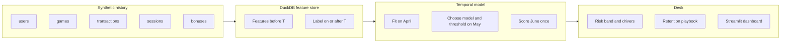

# Player Churn Prediction & Retention Intelligence System for Online Gaming

This project uses synthetic data inspired by common online gaming analytics use cases. It does not contain confidential or proprietary Junglee Games data.

The portfolio lives in this folder because the parent repository already contains unrelated analysis work. Nothing here replaces that root README.

## 1. Overview

An online gaming desk needs to know which **currently active** players are likely to go silent, while there is still time to do something about it. This repository is the analytical system for that decision: a synthetic event history, a leakage-safe feature store in SQL, a temporal model bake-off, player-level risk scores, a rule-based retention router, and a dashboard that reads saved artifacts.

The model ranks risk. It does not prove that a bonus, a host call, or a journey will keep anyone. Incremental retention is an experiment, specified in [docs/retention_strategy.md](docs/retention_strategy.md), not a number this model can emit.

## 2. Business problem

CRM, Product, and VIP retention share one scarce resource: attention. Most active players will play again. Calling all of them wastes the desk and trains players to ignore the brand. The useful question is narrower:

> Among players who played at least once in the last 30 days, who will play **no game** in the next 30 days?

Full problem statement: [docs/business_problem.md](docs/business_problem.md).

## 3. Why churn matters in gaming

A silent player is not only a lost session. In a rake-based game the platform earns when the player sits down. Thirty days of silence is a missed deposit cycle, a missed tournament weekend, and — for a VIP — a relationship that is expensive to rebuild. The cost is asymmetric:

- Contacting a player who would have stayed (false positive) spends a message, a host minute, or a bonus.
- Missing a player who goes silent (false negative) spends the relationship.

Accuracy hides that tradeoff. On the June book, 78.4% of active players are retained. A model that scores everyone as retained is 78.4% accurate and saves nobody.

## 4. Dataset

| File | Grain | Role |
| --- | --- | --- |
| `data/raw/users.csv` | player | Registration, device, channel, VIP segment |
| `data/raw/games.csv` | game | Variant, entry fee, result, rake, duration |
| `data/raw/transactions.csv` | wallet event | Deposit, withdrawal, bonus ledger, cashback |
| `data/raw/sessions.csv` | session | Duration, logins, app version, device |
| `data/raw/bonuses.csv` | bonus grant | Type, amount, whether it was used |

The generator (`src/data_generation.py`) builds **100,000** players. Event files are large and are gitignored. `python -m src.data_generation` regenerates them from `config/config.yaml` (seed 42). Committed samples live in `data/samples/`.

Players are not clones of one rule. Latent archetypes (loyal, early exit, late exit, intermittent) and behavior modes (stable, gradual exit, shock exit, temporary dip) shift probabilities. Noise remains: some heavy players leave, some low-value players stay, and some accounts are too new to have a stable history. Cohort and archetype labels are **not** columns in the modeling table.

Observed churn on the eligible active base:

| Snapshot | Prediction date | Players | Churn rate |
| --- | --- | --- | --- |
| Train | 2025-04-15 | 88,892 | 16.3% |
| Validation | 2025-05-15 | 82,706 | 17.1% |
| Test | 2025-06-15 | 71,164 | 21.6% |

All three rates sit in the 15–30% band the design asked for. The June rate is higher because the simulated book cooled (recency lengthened, recent game counts fell). That shift is a feature of the exercise, and it is why temporal validation is the number that gets quoted.

## 5. Churn definition

A player is **churned** if summed `games_played` in the 30 days starting on the prediction date is zero.

```
churned = 1  if  SUM(games_played) over [T, T+30 days) = 0
churned = 0  otherwise
```

Already-silent players are out of scope. Eligibility is: registered before T, and at least one game in [T−30 days, T).

## 6. Prediction framework

```
|<—— feature window, 30 days ——>|<—— label window, 30 days ——>|
                            T
                     prediction date
```

- **Feature window:** dates strictly before T. The prediction date is the first day of the outcome window, so it is not a feature day.
- **Prediction window:** [T, T+30).
- **Target:** 1 = churned, 0 = retained.

Three snapshots are frozen in config: train 2025-04-15, validation 2025-05-15, test 2025-06-15. The model and the probability threshold are chosen on April and May. June is scored once.

### How leakage was prevented

1. SQL date predicates. Game, session, wallet, and bonus features filter `event_date < prediction_date`. The only query allowed to read games on or after T is `sql/06_churn_label.sql`, and that query writes the label, not a feature.
2. Eligibility is applied before features are joined, so a player with no prior-month game never enters the matrix.
3. The Python estimator receives an explicit column list (`src/preprocessing.py`). `churned` and `games_in_label_window` are rejected if they appear on that list. Gender, age, city, state, and campaign are kept for EDA and are not scoring features. Snapshot ranks (`RANK`, `DENSE_RANK`, `NTILE`) are computed in SQL for analysis and are excluded from the model because they move when the scored population changes.
4. `tests/test_sql_definitions.py` builds a three-player fixture. Two players share history; only one plays after T. Their feature rows match, and only the silent player is labeled churned. A third player with no game in the feature window is dropped.



## 7. Feature engineering

Definitions are written once, in `sql/`, and executed by `src/feature_engineering.py`. The dictionary — feature, definition, business meaning, why it might predict churn — is [docs/feature_dictionary.md](docs/feature_dictionary.md).

The families are gaming-specific:

- **Engagement:** games, active days, sessions, play time over 7 and 30 days.
- **Recency:** days since last game, login, deposit, withdrawal.
- **Frequency:** games per day and per active day, sessions per active day.
- **Monetary:** deposits, withdrawals, net deposit, rake, entry fees.
- **Trend:** this week versus the previous week, and this fortnight versus the previous fortnight, as `(recent − previous) / (previous + 1)`.
- **Volatility:** standard deviation of daily games, deposits, and session duration.
- **Value:** lifetime games, deposits, rake, tenure, VIP segment.
- **Product:** preferred type and variant, tournament / pool / points / deals affinity.
- **Promotion:** bonus received and used, cashback, bonus dependency. Bonus features come from `bonuses.csv`. Cashback comes from transactions. Bonus ledger rows are not counted twice.
- **Behavioral flags:** activity decline, deposit decline, reduced sessions, high withdrawal-to-deposit ratio, longest inactivity gap inside the feature window.

Decline flags match the SQL and the config: previous week at least 3 games and this week at most 60% of that; previous deposits at least 100 and this week at most 60%; previous sessions at least 2 and this week at most 60%.

## 8. EDA insights

All figures in this section are the June holdout (71,164 active players, **21.6%** churn) from `python -m src.eda_report`. Charts are in `reports/figures/`.

- **Recency dominates the raw association.** Days since last game correlates **+0.292** with churn. Players last seen 15–30 days ago churn at **41.7%** (10,866 players). Players who played yesterday or today churn at **9.6%** (13,024).
- **Volume protects, with diminishing drama.** 1–5 games in 30 days: **34.6%** churn (6,203 players). 41–80 games: **11.1%** (19,021). Correlation of `games_30d` with churn is **−0.162**. Active days correlate **−0.200**.
- **Sessions tell the same story without a one-player bucket.** 1–3 sessions: **34.0%** churn (15,704). 11–14 sessions: **10.8%** (10,664).
- **VIP is not a straight ladder.** Silver is the highest-churn tier at **26.2%** (7,147). Diamond is the lowest at **18.9%** (2,291). A VIP label is not a substitute for recent play.
- **Channel.** Affiliate **26.5%** (7,212) versus Referral **18.5%** (10,168). Device is almost flat: iOS 21.9%, Android 21.5%. Do not brief a device program off this book.
- **Game type.** Deals Rummy **24.2%** versus Points Rummy **19.2%**. Preference is a weak separator next to recency.
- **Tenure.** 0–30 days **24.7%** (1,731 players — a small cell). 181–365 days **20.8%**. New accounts are slightly worse; tenure is not the lever.
- **Deposits.** No deposit in 30 days: **27.8%**. Deposits of 2,000+: **16.3%**. Withdrawal *amount* barely separates (1,000+ at 22.1% versus the book at 21.6%). The retention rule therefore uses **how recently** the player withdrew, not the size of the withdrawal.
- **Decline flag.** Flagged players churn at **24.8%** (24,573) versus **20.0%** unflagged. Real, and smaller than the recency gap. A single week-over-week flag is a routing input, not the model.
- **Value.** Lowest lifetime-rake quartile: **27.7%**. Third quartile: **16.4%**.

Interpretation worth keeping: the desk's first sort is "who has already gone quiet," then "whose week collapsed," then "who is worth a human."

## 9. Model architecture

Training is `src/train.py`.

1. Fit on the April snapshot only.
2. Small grid, stratified cross-validation, average precision as the search metric. Search uses up to 35,000 April rows; every final model is refit on all 88,892 April rows. Random forest and sklearn gradient boosting use 2 folds; the others use 3.
3. Class imbalance: `class_weight` for logistic regression, random forest, histogram gradient boosting, and LightGBM; `scale_pos_weight` for XGBoost; sample weights for sklearn gradient boosting.
4. On May, pick a threshold that maximizes F-beta with **beta 1.5** (recall weighted above precision). Freeze it.
5. Select the champion by **May PR-AUC**, with ROC-AUC as the tie-break. Accuracy is not a vote.
6. Score June once. Also refit the champion hyperparameters on a stratified 70% of June and score the other 30%, so the in-time illusion is visible. That split does not choose the champion.

Preprocessing: median imputation and one-hot encoding inside the sklearn pipelines. Trees are not fed standardized inputs. Logistic regression scales numerics. Gender is excluded so the scorer is not a demographic screen.

Chosen random forest: 80 trees, `max_depth` 10, `min_samples_leaf` 20, `class_weight` balanced. Saved at `models/champion.joblib` (about 4 MB).

## 10. Model comparison

June holdout, each model at **its own** May-tuned threshold. Source: `reports/model_metrics/metrics.json`.

| Model | Accuracy | Precision | Recall | F1 | ROC-AUC | PR-AUC | Threshold | May PR-AUC |
| --- | --- | --- | --- | --- | --- | --- | --- | --- |
| Random forest | 0.653 | 0.354 | 0.728 | 0.476 | 0.721 | **0.372** | 0.46 | **0.648** |
| Logistic regression | 0.642 | 0.345 | 0.728 | 0.468 | 0.716 | 0.367 | 0.64 | 0.529 |
| XGBoost | 0.658 | 0.354 | 0.705 | 0.471 | 0.712 | 0.367 | 0.53 | 0.633 |
| HistGradientBoosting | 0.655 | 0.353 | 0.715 | 0.473 | 0.717 | 0.367 | 0.53 | 0.629 |
| LightGBM | 0.656 | 0.353 | 0.705 | 0.470 | 0.716 | 0.366 | 0.53 | 0.635 |
| Gradient boosting | 0.654 | 0.354 | 0.724 | 0.476 | 0.716 | 0.361 | 0.56 | 0.628 |

Random forest is the champion because May PR-AUC was 0.648 against 0.529 for logistic regression and about 0.63 for the other trees. On June that advantage compressed to 0.372 versus 0.367. XGBoost has the highest June accuracy (0.658) and is not the winner.

June confusion matrix for the forest at 0.46:

|  | Predicted retained | Predicted churn |
| --- | --- | --- |
| Actually retained | 35,277 | 20,488 |
| Actually churned | 4,191 | 11,208 |

False positives are players the desk would contact who played anyway. False negatives are churners the desk never saw. At this threshold the desk contacts 31,696 players, **44.5%** of the active book, to catch 72.8% of churners at 35.4% precision. That is a recall-weighted policy, not a 10% contact budget. The budget view is section 15.

A classifier that calls everyone retained scores **78.4% accuracy and zero recall**. The champion's 65.3% accuracy is worse than that null on accuracy, and it is the correct operating point if the goal is to find churners.

## 11. Temporal validation

| Evaluation | ROC-AUC | PR-AUC | Recall | Precision |
| --- | --- | --- | --- | --- |
| Random 70/30 inside June, same hyperparameters, threshold 0.46 | 0.773 | 0.455 | 0.743 | 0.394 |
| Train April, score June | 0.721 | 0.372 | 0.728 | 0.354 |
| May validation, same frozen threshold | 0.877 | 0.648 | 0.736 | 0.557 |

April cross-validated average precision was about 0.72 for the forest and about 0.60 for logistic regression. June PR-AUC is about 0.37. The in-time split flatters the model because it trains on the same month it scores, including the same cooled behavior. A retention model in production is always trained on an earlier month. Temporal validation is the honest number. Notebook `04_temporal_validation.ipynb` walks the comparison.

## 12. Explainability

Two views, both computed on the June book by `python -m src.explain`. Neither is a causal effect.

**Permutation importance** (drop in PR-AUC when the column is shuffled, 4,000-row sample, 3 repeats). This is the model-agnostic ranking:

| Feature | Mean PR-AUC drop |
| --- | --- |
| `days_since_last_game` | 0.019 |
| `games_change_14d_vs_previous_14d` | 0.013 |
| `rake_7d` | 0.013 |
| `days_since_last_deposit` | 0.012 |
| `active_days_7d` | 0.011 |

**TreeSHAP** (`shap.TreeExplainer` on the fitted forest, class-1 contributions, one-hot columns summed back to the original feature, all 71,164 June rows):

| Feature | Mean absolute SHAP |
| --- | --- |
| `days_since_last_game` | 0.100 |
| `days_since_last_login` | 0.052 |
| `games_7d` | 0.038 |
| `active_days_7d` | 0.034 |
| `rake_7d` | 0.034 |
| `sessions_7d` | 0.023 |
| `games_change_14d_vs_previous_14d` | 0.018 |
| `days_since_last_deposit` | 0.014 |

Mean absolute SHAP and permutation do not rank the middle of the list identically. Recency is first on both. The two-week game change and days since last deposit move PR-AUC more than their average SHAP magnitude suggests, because a shuffle destroys ranking even when the typical contribution is moderate. Both lists are reported. Neither is a product lever.

Player-level drivers are the three features whose SHAP value pushes **this** score up. They are stored on the score file. A positive contribution means "this value raised the churn score relative to the forest's baseline," not "changing this field in the product would save the player."

## 13. Risk scoring

`src/predict.py` scores the saved champion. It does not retrain. Output: `reports/scores/player_risk_scores.csv`.

| Column | Meaning |
| --- | --- |
| `user_id` | Synthetic id |
| `churn_probability` | Forest score, class-weighted, not a calibrated frequency |
| `risk_band` | LOW / MEDIUM / HIGH / CRITICAL |
| `top_risk_driver_1/2/3` | Features pushing this score up |
| `recommended_action` | Routing rule, not an uplift |

Bands in `config/config.yaml` (policy, not an optimum): MEDIUM ≥ 0.20, HIGH ≥ 0.40, CRITICAL ≥ 0.65, else LOW. On the June book the mean score is **0.529** against a **21.6%** churn rate, so the bands are wide: 14,821 LOW, 21,872 MEDIUM, 5,544 HIGH, 28,927 CRITICAL. Capacity planning should use the top 5/10/20% of the rank, not the CRITICAL label, until scores are recalibrated on a frozen validation month. The separate F-beta threshold (0.46) is for the classification table. It is not claimed to be the right cut for every desk.

## 14. Retention strategy

`src/retention_engine.py` routes **after** the score. Priority for HIGH and CRITICAL:

1. VIP Gold, Platinum, or Diamond, or lifetime rake at or above the 75th percentile of the scored book → **Priority VIP retention**
2. Else, withdrawal within 7 days → **Win-back and product-experience review**
3. Else, deposit-decline flag → **Payment-friction check and reactivation**
4. Else, activity-decline flag → **Engagement journey**
5. Else, low activity (≤ 3 active days, or games at or below the 40th percentile) → **Low-friction re-engagement**
6. Else → **Engagement journey**

CRITICAL prefixes the action with "Urgent — ". LOW is normal lifecycle. MEDIUM is a watchlist with a light nudge and no heavy incentive.

The model does not estimate whether the action works. Playbooks, the experiment, sample size, and ROI arithmetic are in [docs/retention_strategy.md](docs/retention_strategy.md).

## 15. Lift and gains

June, forest scores, decile 1 = highest risk. Base churn 21.6%.

| Decile | Users | Churners | Churn rate | Cumulative capture | Lift |
| --- | --- | --- | --- | --- | --- |
| 1 | 7,116 | 2,953 | 41.5% | 19.2% | 1.92x |
| 2 | 7,116 | 2,746 | 38.6% | 37.0% | 1.78x |
| 3 | 7,117 | 2,492 | 35.0% | 53.2% | 1.62x |
| 4 | 7,116 | 1,848 | 26.0% | 65.2% | 1.20x |
| 5 | 7,117 | 1,924 | 27.0% | 77.7% | 1.25x |
| 6 | 7,116 | 1,070 | 15.0% | 84.6% | 0.69x |
| 7 | 7,116 | 937 | 13.2% | 90.7% | 0.61x |
| 8 | 7,117 | 641 | 9.0% | 94.9% | 0.42x |
| 9 | 7,116 | 420 | 5.9% | 97.6% | 0.27x |
| 10 | 7,117 | 368 | 5.2% | 100% | 0.24x |

If the desk can touch only a slice of the active base:

| Contact share | Players | Churners captured | Precision | Recall | Lift |
| --- | --- | --- | --- | --- | --- |
| Top 5% | 3,558 | 1,530 | 43.0% | 9.9% | 1.99x |
| Top 10% | 7,116 | 2,953 | 41.5% | 19.2% | 1.92x |
| Top 20% | 14,233 | 5,699 | 40.0% | 37.0% | 1.85x |

This is a modest lift, and it should be described that way. The top tenth of the book holds about a fifth of the churners, at roughly twice the base rate. It is still the right way to spend a 10% contact cap. "Accuracy = 85%" would describe a model that mostly says "retained" and does not tell the desk whom to call. The gains chart is the decision.

## 16. A/B testing framework

Eligible population: high-risk players the desk would actually contact (for example the top 10% by score, or HIGH/CRITICAL after calibration). Randomize 1:1 to personalized retention versus business as usual. Primary metric: D30 retention (played at least once in the next 30 days). Secondary: D7 retention, games per user, active days, rake, deposits, unsubscribe and complaints. Guardrails: promo cost, bonus cost, negative customer experience.

Report the difference in retention with a confidence interval, then convert an incremental retained player into contribution margin minus incentive cost. Do not read the model's precision as the incremental effect. Detail, including a sample-size sketch and the ROI identity, is in [docs/retention_strategy.md](docs/retention_strategy.md).

## 17. Dashboard

`app.py` is a Streamlit app with five pages. It reads `reports/scores/`, `reports/aggregates/`, and `reports/model_metrics/metrics.json`. Startup does not fit a model.

1. **Executive overview** — players, holdout churn, high-risk count, critical count, average score.
2. **Churn analytics** — VIP, channel, game type, tenure, games, recency.
3. **Player risk** — search a synthetic `user_id`; probability, band, segment, engagement, monetary, drivers, action.
4. **Retention targeting** — top 5/10/20% with recall and lift.
5. **Model performance** — ROC-AUC, PR-AUC, precision, recall, F1, confusion matrix, lift, gains.

```bash
streamlit run app.py
```

## 18. Model monitoring

Canonical note: [docs/model_monitoring.md](docs/model_monitoring.md). The same checklist, with the latest numbers, is in [monitoring/model_monitoring.md](monitoring/model_monitoring.md).

What moved between April and June (PSI; watch 0.10, act 0.25):

| Feature | PSI | April mean | June mean |
| --- | --- | --- | --- |
| `days_since_last_game` | 0.412 | 4.08 | 7.38 |
| `games_change_7d_vs_previous_7d` | 0.365 | 2.47 | 0.96 |
| `games_7d` | 0.283 | 10.28 | 6.57 |
| `lifetime_rake` | 0.151 | 1,493 | 2,252 |

Score PSI from May to June is **0.295**. A simulated further drop (recent games, sessions, and rake × 0.7, plus four days of recency) moves the mean score from **0.529 to 0.615** with score PSI **0.462**, before any new label exists. That is the point of the monitor.

Matured performance to recompute: ROC-AUC, PR-AUC, recall, precision, and calibration (bin average score versus observed churn). Accuracy is recorded and does not trigger a retrain.

## 19. How to run

Python 3.11 or 3.12. From this directory:

```bash
python -m venv .venv
source .venv/bin/activate
pip install -r requirements.txt
python -m src.pipeline --n-users 100000
```

That generates the raw events, builds the SQL feature store in DuckDB, writes EDA, trains the six models, explains the champion, segments, scores, and runs the monitoring check. Pieces:

```bash
python -m src.data_generation --n-users 100000
python -m src.feature_engineering
python -m src.eda_report
python -m src.train
python -m src.explain
python -m src.segmentation
python -m src.predict
python -m src.monitoring
pytest tests/test_sql_definitions.py
jupyter nbconvert --to notebook --execute --inplace notebooks/01_eda.ipynb
streamlit run app.py
```

Notebooks assume the working directory is this folder or `notebooks/`. They load the processed dataset and the saved metrics. Notebook 02 refits logistic regression on a sample so the baseline is real computation, not a pasted table.

Paths in config are relative to this folder. There are no hardcoded absolute paths.

## 20. Business impact

What this system changes, if the scores are used as a rank:

- A 10% contact cap reaches players churning at 41.5% instead of 21.6%, and holds 19.2% of churners instead of 10%.
- VIP and high-rake players inside that list are routed to a human before a generic bonus is fired.
- A recent withdrawal routes to a product review rather than another deposit offer.
- The experiment in the retention doc is what turns that routing into a measured incremental retention and an ROI.

What it does not change by itself: the number of players who stay. No uplift is claimed from the June backtest.

## 21. Limitations

- The data are synthetic. Levels of AUC are evidence the pipeline is coherent. They are not a forecast for a live economy. Re-estimate on production history before a launch.
- June PR-AUC is 0.37. Ranking is better than chance (top-decile lift 1.92x) and is not a sharp screen. Do not brief it as a high-AUC fraud model.
- The forest beat logistic regression clearly on May and only narrowly on June. Do not oversell the algorithm.
- Scores are not calibrated. Mean June probability 0.529 versus churn 0.216. Bands and the 0.46 threshold over-contact if they are treated as frequencies.
- Feature PSI on recency and recent games is already above 0.25 between April and June. The May threshold is not automatically valid for a later month.
- One anchor play date is sometimes inserted so simulated cohorts remain identifiable. Stochastic play still dominates volume. The label is always the outcome window, not the anchor.
- SHAP and permutation explain the score. They do not say what happens if Product changes the feature.
- K-means silhouette at the chosen K=4 is 0.29. Segments are an operational compression, not a natural law. The promotion-sensitive centroid is short-tenure and almost entirely bonus-funded at fit time; June members of that cluster are older on average (about 112 days) because the same bonus-only pattern persists. Do not read the name as "registered this month."
- Gender is on the user file for EDA and is not a model feature. The score is still not a responsible-play or vulnerability label.

## 22. Future improvements

- Isotonic or Platt calibration fit on May only, then applied forward, so bands mean frequencies.
- A contact-capacity constraint inside threshold selection (maximize recall subject to contacting at most 10%).
- Time-aware boosting or a discrete-time hazard, once more than three snapshots exist.
- Uplift modeling only after the experiment has produced a treatment outcome. Not before.
- Champion/challenger scoring in the warehouse, with PSI on the same SQL feature definitions.

---

## How I would explain this project in an interview

We had a CRM problem, not a classification trophy. Active players on a gaming platform go silent, and the desk can only talk to a fraction of them. I defined churn as no game in the 30 days after a prediction date, and I built every feature from the 30 days before that date so the label cannot leak.

The data are synthetic, a hundred thousand players plus their games, sessions, wallet, and bonuses, with realistic noise: heavy players usually stay, but not always. SQL in DuckDB produces the player table — windows, lags, ranks — and a unit test checks that a future game does not change the features.

I trained on April, picked the model and the threshold on May, and reported June. Random forest won May PR-AUC, 0.65 against 0.53 for logistic regression. On June they are almost tied, about 0.37, and an in-time split on June looks better, 0.45. That gap is the reason I do not quote a random split. Accuracy is the wrong headline: calling everyone retained is 78% accurate and catches nobody. At a recall-weighted threshold the forest catches 73% of June churners and contacts 45% of the book. If the desk can only contact 10%, the top decile churns at 42%, about 1.9 times the base rate, and holds 19% of the churners.

The drivers the model actually uses start with days since the last game. TreeSHAP on all 71,164 June rows also puts days since last login, games in the last week, active days, and recent rake next to it. Shuffling the two-week change in games or days since last deposit hurts PR-AUC, so those stay on the list even though their average SHAP is smaller. I would hand CRM a rank, a band, three drivers, and a playbook — VIP host, withdrawal review, deposit friction, or a light journey — and I would tell them the playbook is a hypothesis. We measure it with a randomized holdout on D30 retention, not with the model's precision. And I would not ship the May threshold into a month whose recency PSI is already 0.41.

## Senior Data Consultant Discussion Points

**Why 30-day churn?**
It matches a CRM cycle and a deposit cycle. Seven days is mostly weekly seasonality. Sixty or ninety days leaves the player gone before the label arrives. Thirty days is long enough that "no game" is a real silence, and short enough that an intervention can still be timed. The same window is the feature window, so the desk and the model are talking about the same horizon. It is a product choice, not a law.

**Why not accuracy?**
June retention is 78.4%. Predicting "stays" for everyone scores 78.4% and recall 0. The champion at its validation threshold scores 65.3% accuracy, 72.8% recall, 35.4% precision. Accuracy fell because we chose to find churners. PR-AUC (0.372 versus a base rate of 0.216) and recall at a fixed contact rate are the metrics that match the decision.

**Why temporal validation?**
A random split inside June scores PR-AUC 0.455 and ROC-AUC 0.773. The April model on June scores 0.372 and 0.721. Production always trains on the past. The random split trains on the same cooled month it evaluates, so it cannot see the drift in recency and recent games. May was used to choose the model precisely so June stayed clean.

**How was leakage prevented?**
Features require `event_date < prediction_date`. The label query is the only one that reads the outcome window, and its columns are banned from the estimator. Eligibility drops anyone already inactive. A fixture test gives two players the same history and a future game to only one of them; the feature rows match. Ranks that depend on who else is scored that day are computed and then excluded.

**Why the tree model rather than logistic regression?**
On May, random forest PR-AUC was 0.648 and logistic regression was 0.529, with similar recall once each had its own threshold. That is a real ranking gain, which is what a contact list needs, and it is why the forest was selected. On June the PR-AUC gap is 0.372 versus 0.367 and ROC-AUC is 0.721 versus 0.716. The out-of-time win is small. I would keep the forest as the ranker and keep logistic regression as the auditable baseline. I would not tell a stakeholder that the algorithm was the source of the business result. The features were.

**How do you choose a probability threshold?**
State the constraint, then tune on a validation month you will not quote. Here the constraint was "miss fewer churners than a balanced F1," so F-beta with beta 1.5 on May produced 0.46. That cut contacts about 45% of June because the score level drifted. If the constraint is "we can call 10%," ignore 0.46 and take the top decile. If incentives are expensive, raise precision until bonus cost fits the guardrail. There is no universally optimal threshold. Recalibrate before you treat 0.46 as a frequency.

**How would CRM use the model?**
Each morning, score players who were active in the last 30 days. Sort by probability. Inside the contact cap, read the band, the segment, and the three drivers, then apply the router: high-value players to a host, recent withdrawals to a product review, deposit decline to payments, activity decline to a journey, everyone else low-friction. Suppress anyone already in a journey. Do not auto-issue a large bonus from the score alone.

**How do you measure incremental retention?**
Randomize eligible high-risk players to the playbook versus business as usual. Primary endpoint: played at least once in the next 30 days. The incremental retention is the difference in that rate. A confidence interval on the difference is the claim. The model's recall is not the claim. Secondary metrics (D7, games, rake, deposits) and guardrails (bonus cost, complaints, unsubscribes) are pre-declared so a rake spike bought with an ugly offer does not count as a win.

**How do you calculate ROI?**
Incremental retained players × contribution per retained player over the horizon you are willing to defend, minus incentive cost minus operational cost, divided by the cost. Contribution here is margin on rake and net deposits you can attribute to the extra active days, not gross deposits. If the interval on incremental retention covers zero, ROI is not reportable as a point.

**How do you monitor drift?**
Weekly PSI on the features the model actually uses, against the training snapshot, plus PSI of the score and the share of players above the contact cut. Watch at 0.10, act at 0.25. In this run, days since last game already has PSI 0.41 from April to June, and the score PSI from May to June is 0.30. When labels mature, recompute PR-AUC, ROC-AUC, recall, precision, and a calibration curve. Do not refit the threshold on the month you use for the claim.

**What if player behavior changes?**
Separate a pipeline bug from a real change. A broken window or a double-counted bonus: stop scoring, fix the SQL, do not retrain. A real product change: keep the rank if the monitor says the ordering may still help, flag the PSI, and wait for one matured label window. Then retrain on a new temporal split. Do not shuffle the new month into April and quote the random-split AUC.

**How do you deploy?**
Score a snapshot with the saved joblib and the same SQL. The dashboard already works this way: no fit on startup. The feature job is a scheduled query; the score job is a batch write of `user_id`, probability, band, drivers, and action into the CRM table. Threshold and band cuts are config, reviewed when score PSI trips, not buried in the pickle. Retrain is a separate, reviewed pipeline.

**How do you explain the model to a business stakeholder?**
"Among players who played this month, we rank who is most likely to play nothing next month. The strongest signal in this run is how long it has been since they played. The forest also uses recent logins, games and rake in the last week, and — when we shuffle columns — the two-week change in games and how long it has been since a deposit. If we only call the riskiest 10%, about two in five of those calls are players who do go silent, versus about one in five in the whole active base. The score does not mean our call will save them. We find that out with a holdout."
